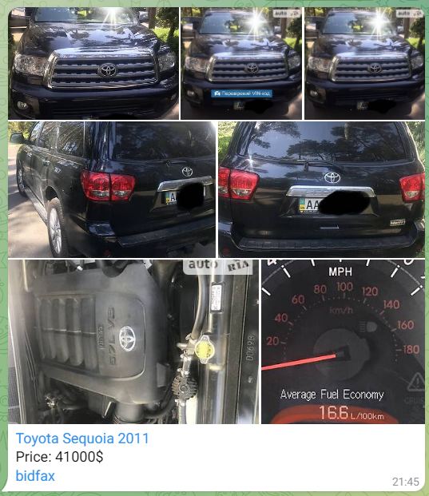

# Python-Automation-Masters
# AUTORIA web scraper
Web-scraper for auto.ria.com with telegram notifications

## Environment variables
To set up the scraper and enable Telegram notifications, you need to use environment variables. Before installing the project, replace the values of the bot token and search settings, or use the values already entered in the .env.sample file. Rename the file to .env after making the necessary changes
```shell
BOT_TOKEN = <YOUR_BOT_TOKEN>
BASE_URL = <YOUR_BASE_URL>
TYPE_CAR = <YOUR_TYPE_CAR>
BRAND_CAR = <YOUR_BRAND_CAR>
MODEL_CAR = <YOUR_MODEL_CAR>
AUTO_FROM_USA = True or False
CAR_ACCIDENT = True or False
```
### How to install
Clone the repository and activate the virtual environment (venv)
```shell
git clone https://github.com/WDemidenko/Python-Automation-Masters.git
cd Python-Automation-Masters
python -m venv venv
source venv/bin/activate (on Linux or macOS)
venv\Scripts\activate (on Windows)
```

### Start the scraper using Docker
- Make sure you have installed Docker 
- Run the following commands:
- `docker build -t auto_ria .`
- `docker run auto_ria`
- To stop all current docker containers:
- `docker stop $(docker ps -q)`

### Connect Your Telegram Account
After running the script, follow these steps to receive notifications:
- If you are using my bot token, connect to the bot on Telegram using this link: [telegram_bot](https://t.me/auto_ria_notifications_bot), or create your own bot.
- Start a conversation with the bot by pressing the **Start button**   The script will be waiting for you to do this to start working

